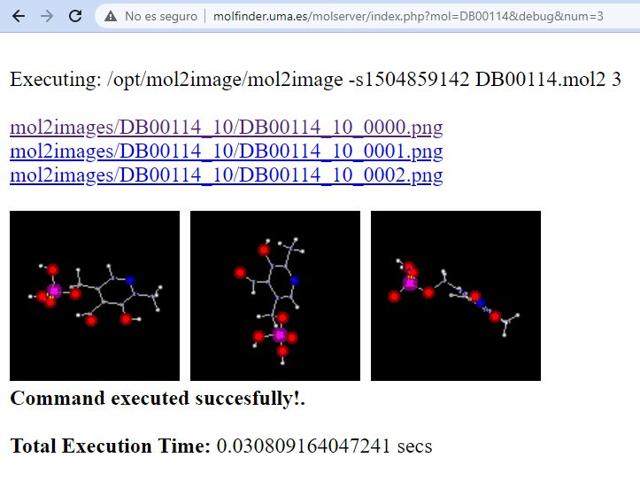
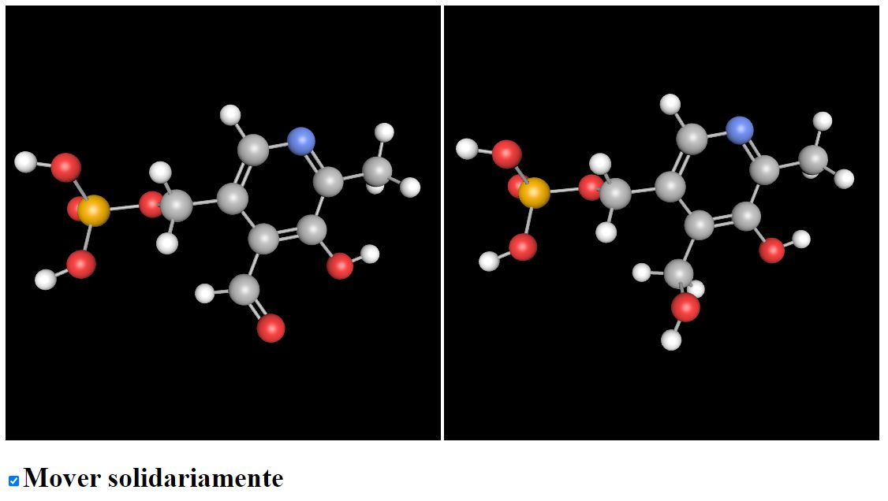

# MolServer

Molserver is an image server that is part of the [molfinder](http://molfinder.ual.es). application suite. In particular, it is the component responsible for:

* Generating the set of random projections of a molecule, which are used for the query to the Molnet2D artificial intelligence engine.

* Visualizing a pair of molecules using [ChemDoodle](#licences) and [Open Babel](#licences)

## Image Generation

The image generation component is accessed through the [index.php](/index.php)page. The result is a plain text list of URLs relative to the server, as well as the generation of the projected images in a folder. The following GET parameters are passed to the page:

* mol=molname: This is the name of the molecule, using the name of the file from the  [Drugbank](https://go.drugbank.com/) database without an extension, and respecting capitalization. This parameter is mandatory.
* num=number: The number of images to be generated. If not specified, the number indicated in the code (8) will be used.
* debug: A parameter that is used to display additional information. In addition, along with the plain list of generated images, the image URLs and a preview of the images are shown.
* seed=number: Seed used for random generation. If not specified, a time stamp will be used.
* hq: In this case, high quality images are generated (256x256 pixels)




The code generates images in three steps:

1. If the mol2 file or the mol file does not exist, it downloads the mol file from a public database.
2. If the mol2 file does not exist, it converts the mol file to a mol2 file using shell_exec (php).
3. It executes the _mol2image_ application, which is part of the [DeepMol repository](https://github.com/luisfromero/DeepMol)

## Visualization of the molecules

The [visor.php](/visor.php) page displays two windows, each with one molecule. The two molecules are passed as GET parameters, with the name of the molecule without an extension. For each one, the process consists of creating the canvas, loading a "default" molecule, and reading the queried molecule using ChemDoodle:

```js
var wh=500;
let canvas1 = new ChemDoodle.TransformCanvas3D('canvas1', wh, wh);
let canvas2 = new ChemDoodle.TransformCanvas3D('canvas2', wh, wh);
cargaInicial(canvas1,nombre1);
cargaInicial(canvas2,nombre2);
ChemDoodle.io.file.content('http://molfinder.ual.es/molserver/mol/'+molecula1,callback1 );
ChemDoodle.io.file.content('http://molfinder.ual.es/molserver/mol/'+molecula2,callback2 );	
```



The functions cargaInicial, callback1 and callback2 are implemented in the attached javascript code visor.js. In this code, the most interesting part is implemented in the function miondrag (my onDrag) that allows rotating both molecules at the same time. To do this, it is necessary to know the inverse of the rotation matrices of the two molecules at the time this functionality is activated (oldmat1 and oldmat2). From that moment, if molecule A is rotated, molecule B is calculated how it should move through a pair of operations with the matrices oldmat2 and the current matrix of molecule B.

## Licences
<a name="chemdoodle"></a>
This project uses Chemdoodle, a chemical graphics and cheminformatics software.<br/>
Copyright © 2012 iChemLabs, LLC. All rights reserved.<br/>
Licensed under the GPL 3.0.
Visit https://www.chemdoodle.com for more information.
 
<a name="obabel"></a>
This project uses Open Babel, a chemical toolbox designed to speak the many languages of chemical data.<br/>
Copyright © 2002-2018 Open Babel Contributors. All rights reserved.<br/>
Licensed under the GPL 3.0.
Visit http://openbabel.org for more information.
